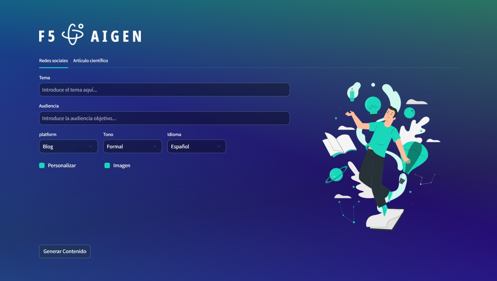

# F5AIGEN🚀

    Generador-de-contenido/
    │
    ├── api/                         # Backend con FastAPI
    │   ├── __init__.py
    │   └── main.py                  # Punto de entrada de la API
    │
    ├── assets/output_images/        # Carpeta para guardar las imágenes generadas
    |
    ├── frontend/                    # Aplicación frontend basada en Streamlit
    │   ├── __init__.py
    │   ├── app.py                   # Punto de entrada de la interfaz gráfica
    │   └── static/                  # Archivos estáticos utilizados en la interfaz
    │       ├── img/                 # Recursos gráficos
    │       │   ├── img.svg
    │       │   └── logo.png
    │       ├── creativity-styles.css # Estilo personalizado para svg
    │       └── style.css            # Hoja de estilos principal
    │
    ├── src/                         # Lógica del negocio y componentes compartidos
    │   ├── __init__.py
    │   ├── arxiv_client.py          # Módulo para interactuar con arXiv (funcionalidad RAG)
    │   ├── generate_prompt.py       # Generación y manejo de prompts
    │   ├── main.py                  # Controlador alternativo de la lógica
    │   ├── moderation.py            # Moderación del contenido generado
    │   ├── prompt_manager.py        # Validación y gestión de prompts
    │   ├── rag_pipeline.py          # Implementación de la funcionalidad RAG
    │   ├── text_to_image.py         # Generación de imágenes a partir de texto
    │   ├── traductor.py             # Traducción y localización
    │   └── utils.py                 # Utilidades compartidas por la aplicación
    |
    ├── .gitignore                   # Archivos ignorados por Git
    ├── run.py                       # Script principal para ejecutar la aplicación
    ├── README.md                    # Documentación del proyecto
    └── requirements.txt             # Dependencias del proyecto
